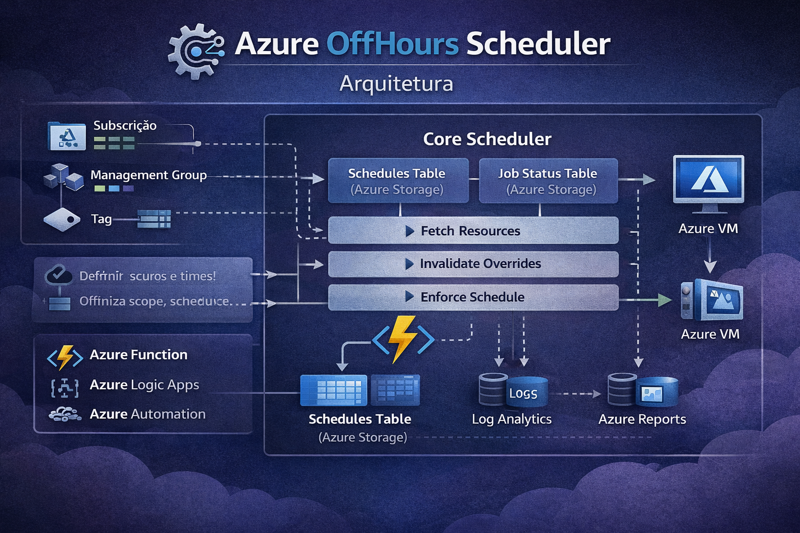

# Azure OffHours Scheduler


English version: [README.en.md](README.en.md)

**Desligue automaticamente recursos não produtivos fora do horário, de forma centralizada, auditável e segura.**

Azure OffHours Scheduler é uma automação open source pronta para produção que reduz custo no Azure com schedules orientados por tabela, escopo controlado e execução segura.

## Por Que Este Projeto?

- Reduz custo de compute sem exigir automações diferentes para cada time
- Permite operação segura com schedules editáveis após o deploy
- Suporta ambientes enterprise com múltiplas subscriptions e governança centralizada
- Respeita intervenções manuais com regras de retenção
- Mantém a solução enxuta, previsível e simples de operar

## O Problema

Grande parte das soluções de off-hours falha nos mesmos pontos:

- schedules ficam hardcoded em arquivos ou app settings
- alterar janelas operacionais exige código ou redeploy
- controlar escopo entre subscriptions vira operação manual e frágil
- overrides manuais são desfeitos rápido demais
- os logs mostram que algo rodou, mas não deixam claro o resultado

## Por que não usar scripts ou automações simples?

Abordagens tradicionais costumam:

- quebrar em escala multi-subscription
- misturar config com código
- não respeitar overrides manuais
- não ter auditoria clara

Este projeto resolve esses pontos com um modelo table-driven e governança explícita.

## A Solução

Azure OffHours Scheduler centraliza a configuração operacional do scheduler sem misturar regra de negócio com configuração técnica de runtime:

- runtime fica em app settings da Function e no Bicep
- schedules e comportamento global ficam em Azure Table Storage
- os recursos entram no ciclo por tag, por exemplo `schedule=business-hours`
- o escopo pode ser controlado por subscription, management group e exclusões
- cada execução gera um relatório estruturado com resultado por recurso

## Arquitetura Simplificada




Tabelas principais:

- `OffHoursSchedulerConfig`
- `OffHoursSchedulerSchedules`
- `OffHoursSchedulerState`

## Quick Start

Setup:

```bash
python3 -m venv .venv
source .venv/bin/activate
pip install -r requirements.txt
az login
```

Use `infra/bicep/main.parameters.json` como arquivo principal de deploy.
Se precisar consultar opções mais avançadas do template, veja `infra/bicep/main.parameters.example.json`.
Se `resourceGroupName` ficar vazio, o wrapper de deploy gera automaticamente `rg-<namePrefix>-<suffix>`.

Parâmetros mínimos:

- `location`
- `namePrefix`
- `subscriptionIds` ou `managementGroupIds`

Parâmetro opcional útil:

- `resourceGroupName`
  Se preenchido, força um nome fixo para o resource group. Se vazio, o deploy gera um nome automaticamente a partir de `namePrefix`.

Parâmetro obrigatório para operação via CLI:

- `tableOperatorsGroupObjectId`
  Concede `Storage Table Data Contributor` ao grupo Microsoft Entra que vai operar a CLI e as tabelas.

Sem esse grupo, a Function continua funcionando, mas operadores humanos não conseguem aplicar `config` e `schedule` com `./offhours` usando Microsoft Entra ID.

Modelos recomendados:

- usar um grupo Microsoft Entra já existente que contenha os operadores da solução
- criar um grupo novo, por exemplo `azure-offhours-operators`, adicionar os usuários e informar o `objectId` no deploy

Deploy:

```bash
make deploy
```

Ou:

```bash
./scripts/deploy_scheduler.sh
```

O fluxo recomendado já publica a Function, sincroniza os triggers, registra `OffHoursTimer` no Azure e grava `.offhours.env` para a CLI local.

Seed inicial recomendado pela CLI:

```bash
az logout
az login
./offhours config apply --file runtime.yaml --execute
./offhours schedule apply --file business-hours.yaml --execute
```

- `az logout` / `az login`
  Se o deploy acabou de criar RBAC de tabelas para o grupo operador, pode ser necessario renovar as credenciais locais antes do primeiro `apply`.
- `config apply --file runtime.yaml --execute`
  Cria ou atualiza a configuracao global do scheduler na tabela `OffHoursSchedulerConfig`, incluindo comportamento como `DRY_RUN`, timezone padrao, chave da tag de schedule e regras de retain.
- `schedule apply --file business-hours.yaml --execute`
  Cria ou atualiza o schedule `business-hours` na tabela `OffHoursSchedulerSchedules`, com a janela operacional que sera referenciada pelas tags dos recursos.


## CLI Operacional

A operação diária da solução pode ser feita pela CLI local do repositório.
O escopo dela foi mantido simples:

- criar, atualizar e excluir schedules
- consultar e alterar a configuração global
- consultar e excluir registros de state
- disparar manualmente a Function do scheduler

```bash
./offhours --help
```

A CLI usa `DefaultAzureCredential` por padrão.
A implicação prática é que os operadores precisam ter `Storage Table Data Contributor` na storage do scheduler, normalmente via `tableOperatorsGroupObjectId` no deploy.

Uso recomendado no dia a dia:

```bash
az login
./offhours state list
```

No fluxo recomendado, `./scripts/deploy_scheduler.sh` grava automaticamente `.offhours.env` na raiz do repositório.
O wrapper `./offhours` lê esse arquivo sozinho, então você não precisa exportar `OFFHOURS_TABLE_SERVICE_URI` manualmente depois do deploy.

Resolução de contexto da CLI:

1. se `OFFHOURS_TABLE_SERVICE_URI` já estiver definida no shell, ela é usada
2. caso contrário, `./offhours` tenta carregar `.offhours.env`
3. esse arquivo é gerado automaticamente no fim do deploy recomendado

Na prática, depois de um deploy bem-sucedido, o fluxo esperado é:

```bash
az login
./offhours ...
```

Validação rápida pós-deploy:

```bash
./offhours state list
./offhours function trigger
./offhours state list
```

Exemplos de operação:

```bash
./offhours config get
./offhours config apply --file runtime.yaml
./offhours schedule list
./offhours schedule get business-hours
./offhours schedule apply --file business-hours.yaml
./offhours schedule delete business-hours
./offhours state get \
  --resource-id /subscriptions/<sub>/resourceGroups/<rg>/providers/Microsoft.Compute/virtualMachines/<vm>
./offhours state delete \
  --resource-id /subscriptions/<sub>/resourceGroups/<rg>/providers/Microsoft.Compute/virtualMachines/<vm>
./offhours function trigger
```

Fluxo seguro para mudanças:

1. criar um arquivo YAML ou JSON com a entidade desejada
2. executar `config apply`, `schedule apply`, `schedule delete` ou `state delete` sem `--execute` para preview
3. repetir com `--execute` para gravar ou excluir

Arquivos de referência no repositório:

- `runtime.yaml`
- `business-hours.yaml`

Exemplo de tag em uma VM:

```text
schedule=business-hours
```

Exemplo de schedule em YAML:

```yaml
RowKey: business-hours
Periods:
  - start: "08:00"
    stop: "12:00"
  - start: "13:00"
    stop: "18:00"
SkipDays:
  - saturday
  - sunday
Enabled: true
Version: "2"
```

Exemplo de config global em YAML:

```yaml
PartitionKey: GLOBAL
RowKey: runtime
DRY_RUN: false
DEFAULT_TIMEZONE: America/Sao_Paulo
SCHEDULE_TAG_KEY: schedule
RETAIN_RUNNING: true
RETAIN_STOPPED: true
Version: "1"
```

Observação:

- `Version` deve estar no arquivo
- para operação no dia a dia, prefira YAML com `./offhours config apply` e `./offhours schedule apply`
- a CLI preenche os campos de auditoria no momento do `apply`
- exemplos JSON de entidades continuam em `docs/examples.md` e `docs/architecture.md` como referência de schema

## Casos de Uso

- Ambientes de desenvolvimento e sandbox com horários previsíveis
- Ambientes enterprise com múltiplas subscriptions e governança centralizada
- Iniciativas de FinOps focadas em reduzir custo de compute ocioso

## Funcionalidades

- Schedules e configuração global orientados por tabela
- Suporte a múltiplas subscriptions com escopo opcional por management group
- Regras de include/exclude com precedência explícita de exclude
- Retenção para respeitar override manual do operador
- Filtro regional com `targetResourceLocations`
- Timer técnico configurável com `TIMER_SCHEDULE`
- Fluxo de deploy limpo com Bicep

## Observabilidade

A solução já entrega visibilidade operacional por execução, sem exigir ferramentas adicionais para começar:

- Correlation ID por execução via `run_id`
- Tempo total do ciclo e tempo por recurso com `duration_sec`
- Relatório final emitido como uma única linha JSON em todo ciclo
- Resultado estruturado por recurso com ação, status e motivo
- Em produção, o padrão recomendado é `RESOURCE_RESULT_LOG_MODE=executed-and-errors`
- Logs verbosos de request/response do SDK Azure ficam desabilitados por padrão

Exemplo de formato do relatório:

```json
{
  "run_id": "...",
  "timestamp": "...",
  "dry_run": true,
  "summary": {
    "total": 2,
    "started": 1,
    "stopped": 0,
    "skipped": 1
  },
  "duration_sec": 1.234,
  "resources": []
}
```

## Documentação

- Índice da documentação: [docs/README.md](docs/README.md)
- Arquitetura: [docs/architecture.md](docs/architecture.md)
- Exemplos: [docs/examples.md](docs/examples.md)
- Guia operacional: [docs/operator-guide.md](docs/operator-guide.md)
- Guia de desenvolvimento: [docs/developer-guide.md](docs/developer-guide.md)
- Estrutura do repositório: [docs/repository-map.md](docs/repository-map.md)
- Componentes de código: [docs/code-components.md](docs/code-components.md)
- Troubleshooting: [docs/troubleshooting.md](docs/troubleshooting.md)
- Política de release: [docs/release-policy.md](docs/release-policy.md)

## Recursos Suportados

Hoje:

- `Microsoft.Compute/virtualMachines`

Roadmap:

- `VirtualMachineScaleSets`
- `App Services`
- outros recursos elegíveis para estratégia off-hours

## Princípios de Design

- Dados operacionais ficam em tabelas, não no código
- Configuração técnica de runtime fica separada das regras de negócio
- Defaults operacionais devem ser explícitos
- Escopo deve ser explícito e auditável
- A solução deve continuar simples de operar
- Observabilidade deve crescer sem introduzir complexidade desnecessária

## Contribuição

- Guia de contribuição: [CONTRIBUTING.md](CONTRIBUTING.md)
- Código de conduta: [CODE_OF_CONDUCT.md](CODE_OF_CONDUCT.md)
- Política de segurança: [SECURITY.md](SECURITY.md)
- Licença: [LICENSE](LICENSE)
- A CI valida lint, SAST, audit de dependências, testes, scripts shell e compilação do Bicep

Versão atual:

- `1.0.0`
